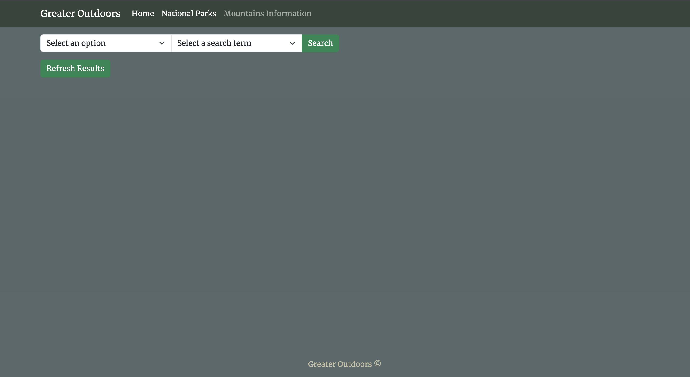
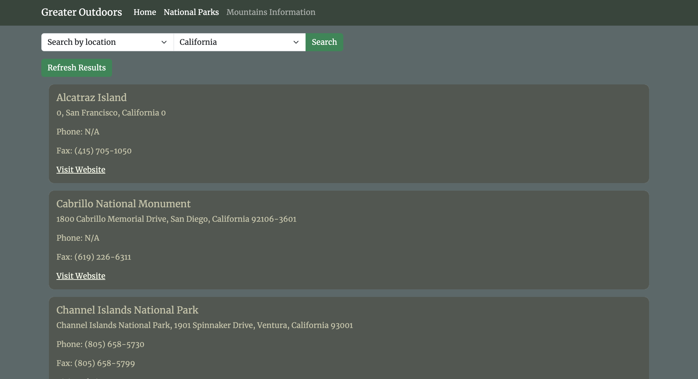
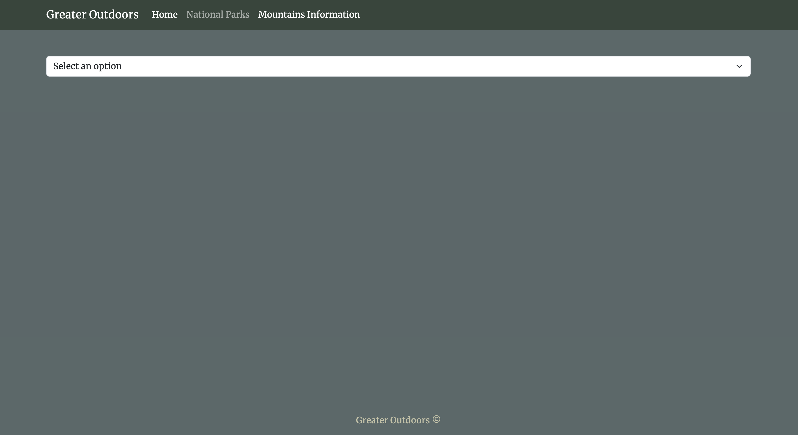
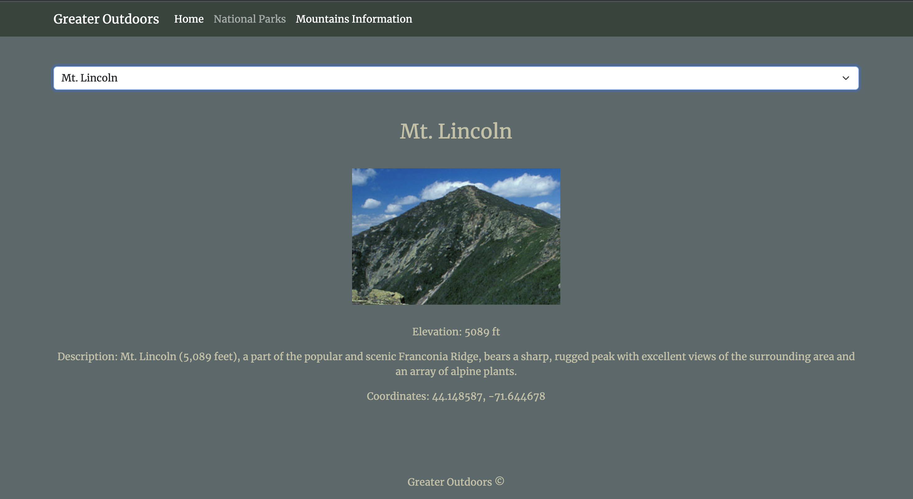

# Enjoy The Outdoors

## Live Preview
Click [here]() for a live preview of the project.

## Project Description

This web application is designed to assist users in discovering national parks and mountains. Users have the ability to search for activities based on location or park type. Additionally, a dropdown menu allows users to select a specific mountain, providing them with detailed information about that particular mountain.

## Live Preview

To see a live preview of the project, click [here]().

## Images

### Home Page

### National Parks Pages

### Mountains Pages

## Interesting Javascript

I've had more problems on the CSS than the Javascript. The biggest problem I did have was making my refresh button though.
